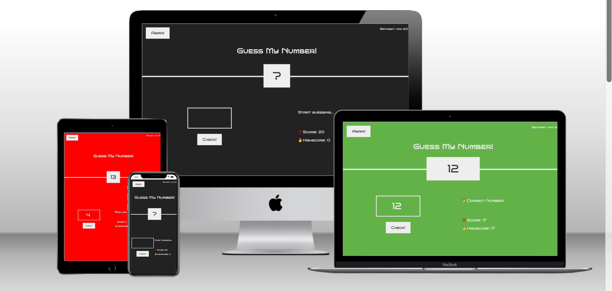
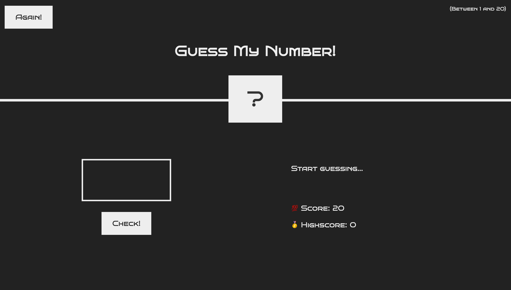

# Guessing Number Game
This is a simple number guessing game built with HTML, CSS, and JavaScript. The game generates a random number between 1 and 20 and the player has to guess the number. If the player guesses correctly, they win the game. If they guess incorrectly, they lose a point from their score. The game ends when the player's score reaches 0 or when they guess the correct number.

# Game Design
The game has a simple design that is easy to use and understand. The user interface consists of a number input, a check button, and a reset button. The game also includes a message area that displays messages to the user, such as whether their guess was too high or too low. The game's background color changes depending on whether the user wins or loses the game. When the user wins the game, the game displays a congratulatory message and the user's score. When the user loses the game, the game displays a message telling the user they lost and the correct number. The game also keeps track of the user's highest score, which is displayed after each game.

## How to Play ?
1. Enter a number between 1 and 20 in the input field and click the "Check!" button.
2. If your guess is correct, you win the game and the background turns green. If your guess is incorrect, the game will tell you if the number you guessed is too high or too low.
3. You have 20 chances to guess the correct number. If you run out of chances, the game ends and the background turns red.
4. If you win the game, your high score will be updated if your current score is higher than your previous high score.
5. Click the "Again" button to reset the game and start over.

# Game Features
Random number generation: The game generates a random number between 1 and 20 each time a new game is started.

20 attempts: The player has 20 attempts to guess the number correctly.

# User interface: 
* The game has a simple user interface that displays the current score, the high score, and a message that tells the player if their guess was too high, too low, or correct.

Score system: The game deducts a point from the player's score each time they make an incorrect guess. The game also keeps track of the player's high score.

Play again: The player can start a new game by clicking the "Play Again" button.

Responsive design: The game has a responsive design that adjusts to different screen sizes.

Accessibility: The game uses semantic HTML and includes ARIA attributes to make it accessible to users with disabilities.

Validation: The game validates user input to make sure that it is a number between 1 and 20. If the input is invalid, the game displays an error message.

Animations: When the player wins, the background color of the page changes to green and the width of the number increases. When the player loses, the background color changes to red.

# Technical Details
## JavaScript
The game logic is implemented in script.js file. The script generates a random number using Math.random() function and converts it to an integer using Math.trunc() function. The score variable keeps track of the player's score and is initialized to 20. The highScore variable keeps track of the player's highest score and is initialized to 0.
The addEventListener() function is used to add event listeners to the .check and .again elements. The click event is used to listen for clicks on the elements. When the .check element is clicked, the script checks the player's guess and updates the game state accordingly. When the .again element is clicked, the game is reset.
## HTML
The index.html file contains the structure of the game. The .message element is used to display messages to the player. The .good element is used to display a message to the player when they win the game. The .score element is used to display the player's current score. The .hidgscore element is used to display the player's highest score. The .guess element is used to get the player's guess. The .check element is used to check the player's guess. The .again element is used to reset the game. The .number element is used to display the correct number when the player wins the game.
## CSS
The style.css file contains the styling of the game. The background color of the body element is changed to green when the player wins the game and red when the game ends. The width of the .number element is increased when the player wins the game to accommodate the correct number.

# Technologies Used
* JavaScript
* HTML
* CSS
## Game Overview
The Guess My Number game is a simple game that allows the user to guess a random number generated by the computer. The game consists of a number input, a check button, and a reset button. The user inputs a number and clicks on the check button to see if the number matches the computer's number. If the user guesses the number correctly, they win the game. If not, the game tells the user whether their guess was too high or too low. The game ends when the user has used all their attempts.
## Game Features
* The computer generates a random number between 1 and 20.
* The user has 20 attempts to guess the correct number.
* If the user guesses the correct number, they win the game.
* If the user's guess is too high, the game tells them to guess a lower number.
* If the user's guess is too low, the game tells them to guess a higher number.
* If the user fails to guess the correct number within 20 attempts, they lose the game.
* The game keeps track of the highest score, which is displayed after each game.
* The user can click on the reset button to start a new game.

